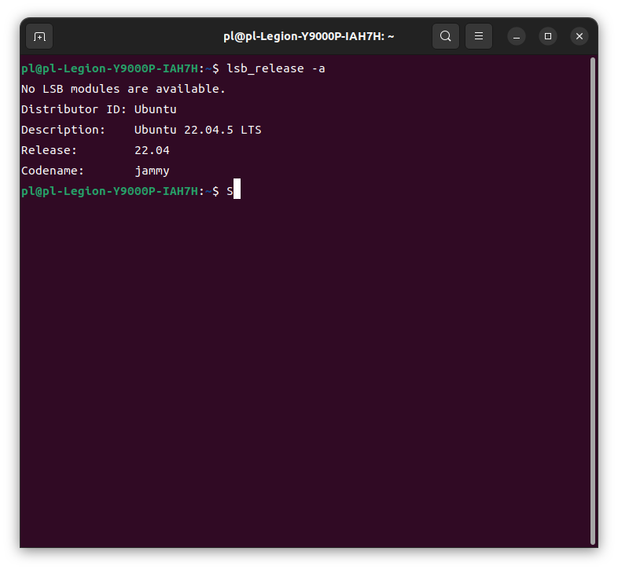
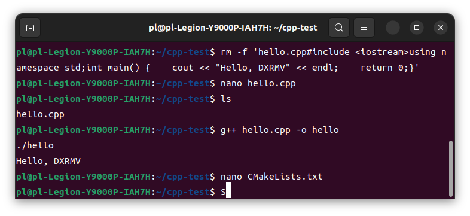

# XJTU-RMV-Task01 作业

## 1. Ubuntu 安装成功截图


## 2. 程序运行截图


## 3. 作业说明
- 系统环境：Ubuntu 22.04 LTS
- C++ 开发环境：gcc / clangd / cmake / VSCode
- 已完成内容：
  1. 配置 Ubuntu 并截图
  2. 熟悉 Linux 基础命令行
  3. 自主使用命令行完成 C++ 环境配置
  4. 编写 CMakeLists，完成 C++ 程序输出 `Hello, DXRMV`
  5. 上传 C++ 工程到 GitHub，并在 README 中展示截图

## 4. 使用方法
在项目目录下执行：

```bash
mkdir build
cd build
cmake ..
make
./hello
# Task01
